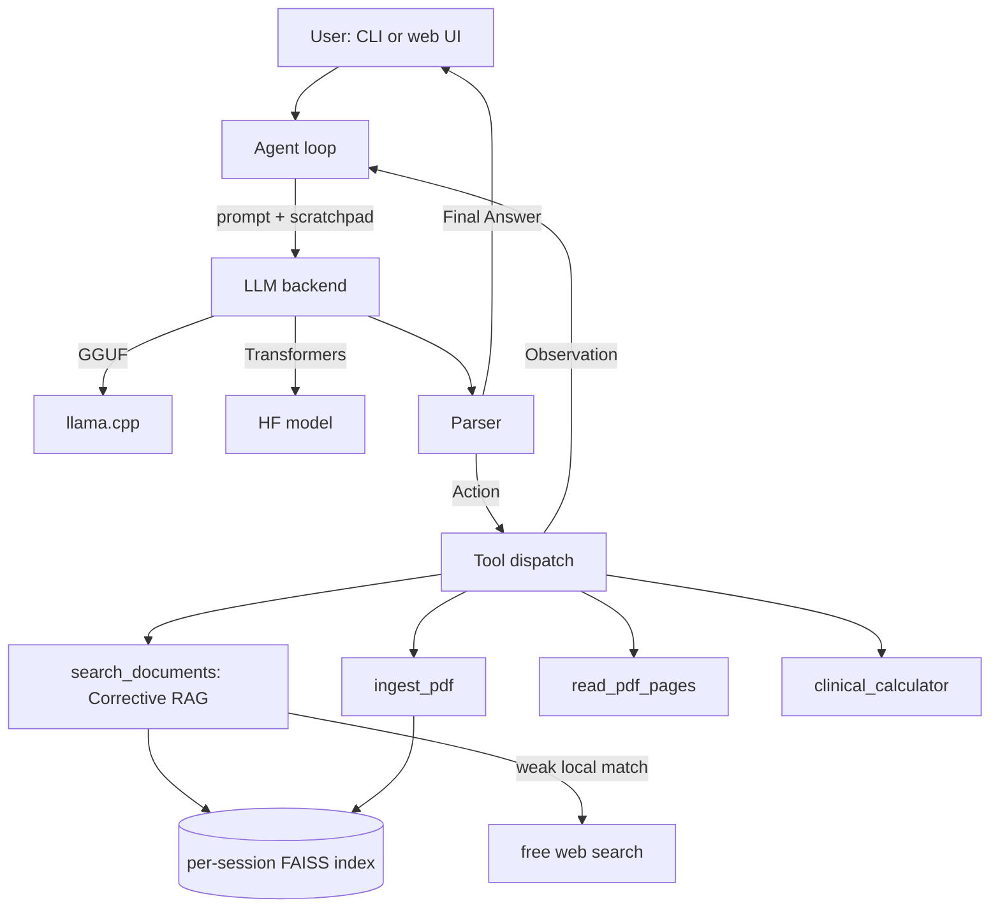

# LlamaMed-3.1-8B-Reasoner-Agent

[](https://huggingface.co/Rumiii/LlamaMed-3.1-8B-Reasoner)
[](LICENSE)

A local, tool-calling AI agent built around **[LlamaMed-3.1-8B-Reasoner](https://huggingface.co/Rumiii/LlamaMed-3.1-8B-Reasoner)**,
a Llama-3.1-8B fine-tune trained on chain-of-thought medical reasoning
(ReasonMed). The agent wraps the model in a ReAct-style tool-calling loop,
adds retrieval-augmented generation over clinical PDFs, and includes a
small set of validated clinical calculators -- all runnable entirely on
your own machine.

> **Not a medical device.** This is a research tool for exploring
> medical-reasoning fine-tunes and local agent design. Nothing it
> produces should inform a real clinical decision without a licensed
> clinician in the loop.

## Features

- **Tool-calling agent loop** -- a from-scratch ReAct loop (Thought /
  Action / Action Input / Observation) with a forgiving parser, rather
  than relying on a specific model's native function-calling template.
  Works the same way regardless of backend.
- **Dual local backends** -- run the model via **GGUF/llama.cpp**
  (default; CPU or GPU, no CUDA toolkit required) or via **Transformers**
  (matches how the model was trained, needs an NVIDIA GPU). Swap with one
  config field or `--backend` flag.
- **Attach PDFs + Corrective RAG** -- attach any PDF (any medical
  subdomain, since the documents define the scope, not hardcoded logic)
  and the agent searches it. Deliberately **one retrieval algorithm, not
  several stacked together**: retrieved passages are graded (a cheap
  similarity threshold, with an LLM double-check only in the borderline
  zone), and when the attached documents don't have a good enough answer,
  the agent automatically falls back to a **free web search** (no API
  key, no account, no email) -- clearly labeling which parts of its
  answer came from your documents versus the web.
  `read_pdf_pages` still gives verbatim text from an exact page range
  when precise wording matters more than a semantic match.
- **Local web UI** -- a Claude-style chat interface (`llamamed-agent ui`):
  sidebar of past chats, attach PDFs with a paperclip button, a
  collapsible reasoning-trace view per reply. Pure HTML/CSS/JS, no
  external network calls from the page itself -- served by a small local
  FastAPI server. The CLI (`chat`/`ask`/`ingest`) keeps working
  independently of the UI.
- **Validated clinical calculators** -- BMI, 2021 CKD-EPI eGFR
  (race-free), anion gap, corrected calcium, mean arterial pressure --
  plain-arithmetic implementations of published formulas, so the model
  doesn't have to (and shouldn't have to) do arithmetic in free text.
- **Local FAISS vector store** -- two files on disk (`index.faiss` +
  `metadata.json`), no server or external service required.
- **Clean CLI** -- `chat`, `ask`, and `ingest` subcommands with a
  readable Rich-rendered trace of the agent's reasoning.

## Architecture



The web UI (`llamamed-agent ui`) is a thin HTTP layer on top of this same
diagram -- `server.py` just translates requests into the same `Agent.run()`
calls the CLI makes, with one FAISS index per chat session so attachments
in one chat don't leak into another.

## Project layout

```
llamamed_agent/
  backends/     GGUF (llama.cpp) and Transformers backends behind one interface
  agent/        ReAct loop, output parser, system prompt
  tools/        search_documents, ingest_pdf, read_pdf_pages, clinical_calculator
  rag/          PDF extraction, chunking, embeddings, FAISS store, Corrective RAG
  ui/           index.html / style.css / app.js -- the local web UI
  server.py     FastAPI server: HTTP <-> Agent, serves ui/
  cli.py        chat / ask / ingest / ui subcommands
scripts/
  convert_to_gguf.sh   HF checkpoint -> GGUF -> quantized GGUF
  download_model.py    pre-download weights for either backend
data/
  pdfs/      put clinical PDFs here for `llamamed-agent ingest data/pdfs`
  index/     FAISS index(es) -- one subfolder per chat session when using the UI
  sessions/  chat history (one JSON file per session), created by the UI server
tests/     offline unit tests (parser, calculators, chunker, Corrective RAG) -- no model needed
```

## Quickstart

```bash
git clone https://github.com/sufirumii/LlamaMed-3.1-8B-Reasoner-Agent
cd LlamaMed-3.1-8B-Reasoner-Agent
pip install -e .
cp config.example.yaml config.yaml
```

### 1. Get a local model file

The GGUF backend is the default. You need a `.gguf` file once:

```bash
bash scripts/convert_to_gguf.sh Rumiii/LlamaMed-3.1-8B-Reasoner Q4_K_M
# -> models/LlamaMed-3.1-8B-Reasoner.Q4_K_M.gguf
```

This downloads the HF checkpoint, clones `llama.cpp`, converts to GGUF,
and quantizes it. Edit `config.yaml` -> `model.gguf_path` if you name the
output differently, or if you've already uploaded a GGUF quant to a HF
repo, set `model.gguf_hf_repo` / `model.gguf_hf_file` instead and skip
this step -- it'll download automatically on first run.

Prefer the Transformers backend instead (needs an NVIDIA GPU)?

```yaml
# config.yaml
model:
  backend: transformers
  load_in_4bit: true   # if you're on a smaller/consumer GPU
```

### 2. Ingest some clinical PDFs (optional)

```bash
cp your_reports/*.pdf data/pdfs/
llamamed-agent ingest data/pdfs
```

### 3. Chat

```bash
llamamed-agent chat
```

or ask a one-shot question:

```bash
llamamed-agent ask "What's the CKD-EPI eGFR for a 62-year-old woman with creatinine 1.4?"
```

### 4. Or use the web UI instead

```bash
llamamed-agent ui
```

Opens a local server at `http://127.0.0.1:8000` serving the chat interface
in `llamamed_agent/ui/` -- sidebar of past chats, a paperclip to attach
PDFs directly in the conversation, and a collapsible reasoning trace per
reply. Each chat gets its own document index, so what you attach in one
chat doesn't show up in another. `--port` to change the port,
`--backend` to override `model.backend` for this run, same as `chat`/`ask`.

## Configuration reference

All fields live in `config.yaml` (see `config.example.yaml`); anything
omitted falls back to the defaults in `llamamed_agent/config.py`.

| Section | Field | Default | Notes |
|---|---|---|---|
| `model` | `backend` | `gguf` | `gguf` or `transformers` |
| `model` | `gguf_path` | `models/LlamaMed-3.1-8B-Reasoner.Q4_K_M.gguf` | local file |
| `model` | `gguf_hf_repo` / `gguf_hf_file` | `null` | auto-download if `gguf_path` is missing |
| `model` | `n_gpu_layers` | `-1` | `-1` offloads all layers if a GPU is available, `0` forces CPU |
| `model` | `hf_repo` | `Rumiii/LlamaMed-3.1-8B-Reasoner` | transformers backend only |
| `model` | `load_in_4bit` | `false` | transformers backend, smaller GPUs |
| `rag` | `index_dir` | `data/index` | FAISS index location |
| `rag` | `embedding_model` | `sentence-transformers/all-MiniLM-L6-v2` | swap for a stronger model if you want |
| `rag` | `top_k` | `4` | chunks returned per search |
| `rag` | `web_fallback_enabled` | `true` | Corrective RAG: free web search fallback when local docs are weak |
| `rag` | `relevance_threshold` | `0.35` | cosine similarity below this triggers the web fallback |
| `rag` | `max_web_results` | `3` | web results fetched on fallback |
| `agent` | `max_iterations` | `6` | Thought/Action cycles before giving up |
| `agent` | `verbose` | `true` | print the reasoning trace to the console |

Every field also has an env-var override (`LLAMAMED_BACKEND`,
`LLAMAMED_GGUF_PATH`, `LLAMAMED_HF_REPO`, `LLAMAMED_TEMPERATURE`,
`LLAMAMED_INDEX_DIR`, `LLAMAMED_TOP_K`).

## Available tools

| Tool | Purpose |
|---|---|
| `search_documents` | Corrective RAG search over attached PDFs; auto-falls back to free web search when local results are weak |
| `ingest_pdf` | Ingest a PDF the agent is told about mid-conversation |
| `read_pdf_pages` | Verbatim text of an exact page range, for when precise wording matters |
| `clinical_calculator` | `bmi`, `egfr_ckd_epi_2021`, `anion_gap`, `corrected_calcium`, `mean_arterial_pressure` |

Adding a new tool means implementing `Tool.run()` in `llamamed_agent/tools/`
and registering it in `tools/__init__.py:build_default_registry` -- no
changes to the agent loop itself are needed.

## Testing

```bash
pip install -r requirements-test.txt
pytest tests/
```

The test suite covers the parser, calculators, chunker, Corrective RAG
scoring/fallback logic, and the server's HTTP contract (session CRUD, a
full attach -> ingest -> retrieve -> answer round trip, per-session
document isolation) -- all against fake backends/embedders, so no model
download or network access is needed and the full suite runs in about a
second.

## Fine-tuning

`scripts/finetune.py` is the exact script used to produce the model, carried
over as-is. `requirements-finetune.txt` lists the install commands it expects
(order matters -- Unsloth's install has to happen after its dependencies).
This is a separate, one-time process from running the agent -- most people
using this repo will just download the already fine-tuned weights and won't
need to run this.

## Model details

- **Base model:** `unsloth/Meta-Llama-3.1-8B-Instruct-bnb-4bit`
- **Dataset:** [lingshu-medical-mllm/ReasonMed](https://huggingface.co/datasets/lingshu-medical-mllm/ReasonMed) -- first 10,000 samples
- **Method:** QLoRA (4-bit), rank 16, via [Unsloth](https://github.com/unslothai/unsloth)
- **Weights:** [Rumiii/LlamaMed-3.1-8B-Reasoner](https://huggingface.co/Rumiii/LlamaMed-3.1-8B-Reasoner)

## Disclaimer

This is a research checkpoint and a research agent framework. It is not
validated for clinical use, has not been reviewed by a regulatory body,
and must not inform real medical decisions. Outputs -- including tool
results like the eGFR calculation -- should always be checked by a
licensed clinician before being acted on.

## License

Apache 2.0
